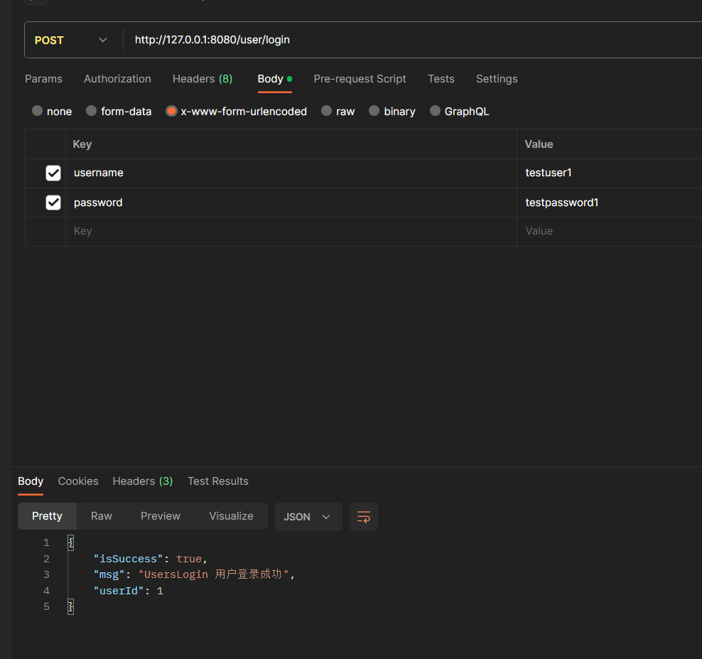

# OnlineShop项目进度_游俊熙

## OnlineShop项目目录内容

| 文件                | 功能                                   |
| ------------------- | -------------------------------------- |
| main.go             | 启动Web服务，设置路由和数据库初始化    |
| controller/user.go  | 处理用户注册和登录请求的控制器         |
| models/comment.go   | 定义评论模型和相关的增删查改函数       |
| models/favorites.go | 定义收藏模型和相关的增删查改函数       |
| models/log.go       | 定义日志模型和相关的增删查改函数       |
| models/order.go     | 定义订单模型和相关的增删查改函数       |
| models/product.go   | 定义商品模型和相关的增删查改函数       |
| models/store.go     | 定义店铺模型和相关的增删查改函数       |
| models/user.go      | 定义用户模型和相关的增删查改函数       |
| mysql/sqlInit.go    | 初始化和关闭数据库连接的函数           |
| routers/routers.go  | 设置路由和路由处理函数的文件           |
| service/user.go     | 处理用户相关业务逻辑的服务函数         |
| go.mod              | 定义项目的依赖关系                     |
| go.sum              | 项目所使用的第三方库的依赖关系和hash值 |

该程序实现了一个在线购物平台的后端功能，包括用户注册和登录、评论管理、收藏管理、日志记录、订单处理、商品管理和店铺管理等功能。


## **项目进展**

### 模板

**日期：** [当前日期]

**进展概述：** 登录功能已经成功编写完成。

**已完成的工作：**

- 实现用户登录接口 `/user/login`，允许用户使用用户名和密码进行身份验证。
- 使用 Gin 框架处理用户登录请求，确保通过验证的用户可以成功登录。
- 编写了相关的服务函数和数据库模型，确保用户数据的正确处理和验证。

### 2023/12/09 登录

**日期：** [2023.12.09]

**进展概述：** 登录功能已经成功编写完成。

**已完成的工作：**

- 实现用户登录接口 `/user/login`，允许用户使用用户名和密码进行身份验证。
- 使用 Gin 框架处理用户登录请求，确保通过验证的用户可以成功登录。
- 编写了相关的服务函数和数据库模型，确保用户数据的正确处理和验证。

**进度展示：**

- 正常登录：

  

- 账号、密码，为空或者有误均会有返回

  ```json
  {
      "isSuccess": false,
      "msg": "用户名不存在"
  }
  ```

  ```json
  {
      "isSuccess": false,
      "msg": "用户密码错误"
  }
  ```

  ```json
  {
      "isSuccess": false,
      "msg": "用户密码不能为空"
  }
  ```

  ```json
  {
      "isSuccess": false,
      "msg": "用户名不能为空"
  }
  ```

  